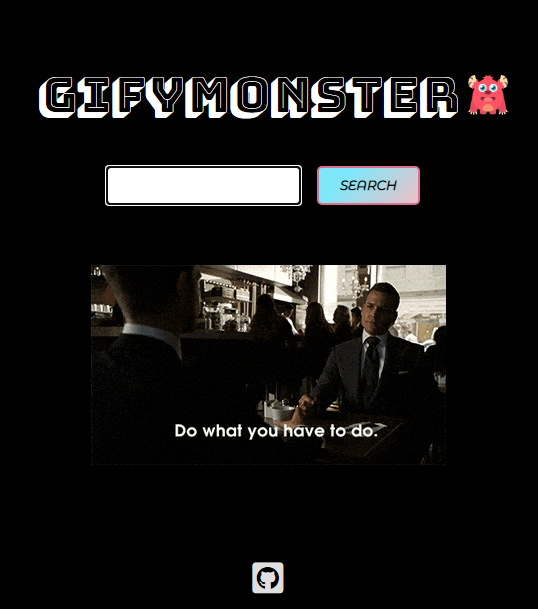

# GifyMonster  :japanese_ogre:
## A place to search for your favourite gifs
### A web-app made to understand the nuances of fetching an API. 
### Here I have used promises to fetch the GIF API from Giphy.com and intergrate it into my web-app.
### Also learned more about the difference between callbacks, promises and Async/Await.

#### Tech Stack  :computer:
* HTML
* CSS 
* JS 

[Demo](https://gifymonster.netlify.app)  

**Oops I'm a Suits fan**

### Fork this repo and try what enhancements you can do. :trident:
